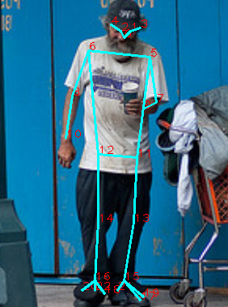
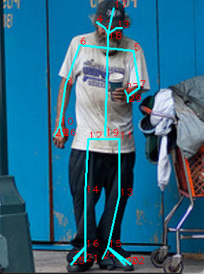

# Minimalistic-HRNet
 
## Introduction
This repo is a lightweight pytorch implementation of the paper : [High-Resolution Representations for Labeling Pixels and Regions](https://arxiv.org/abs/1904.04514 "link")

The official pytorch implementation is here : [HRNet-Human-Pose-Estimation](https://github.com/HRNet/HRNet-Human-Pose-Estimation "link")

HRNet's model structure and details can be found in the the link above.

The main goal of this repo is to make HRNet as easy to use as possible and lightweight enough to implement in any project.

Multi-human pose estimation result : 
([Halpe Full-Body](https://github.com/Fang-Haoshu/Halpe-FullBody?tab=readme-ov-file "link") dataset)


The repo has been tested in :
```
Windows 11
Python 3.8
Pytorch 1.10.2
```

## Installation
Install all the dependencies.

I recommend using a venv manager like Conda to setup your python environment.
```
pip install -r requirements.txt
```

Create three folders in root folder and name them  **data**, **log** and **weight**, then you should have a directory tree like this : 

```
${Minimalistic-HRNet root}
├── data
├── dataset
├── log
├── model
├── util
├── weight
├── .gitattributes 
├── .gitignore
├── joint_test.py
├── joint_train.py
├── LICENSE
├── live_demo.py
├── README.md
└── requirements.txt
```

Done !

## Pre-trained Weights
### COCO-WholeBody (Body keypoints with feet keypoints)

Model parameter : base_channels=48, out_channels=23

Download : 
 [Google Drive](https://drive.google.com/drive/folders/1H7ECKgfVDxi1GwcwshIiD9I9jW2CDdnw?usp=drive_link)


### Halpe Full-Body (Body keypoints with feet keypoints)

Model parameter : base_channels=48, out_channels=26

Download : 
 [Google Drive](https://drive.google.com/drive/folders/1dEMo5L3m4mX9iC8WcxgTqr7WZK7TPuDc?usp=drive_link)

After downloading the weight files, put them inside **weight** folder
```
${Minimalistic-HRNet root}
├── weight
    ├── best_acc.pth
    ├── best_loss.pth
...
```

## Training
### Data Preparation (COCO-WholeBody)
Download **2017 Train images** and **2017 Val images** in [COCO 2017 website](https://cocodataset.org/#download "link")

Download **COCO-WholeBody annotations** in [COCO-WholeBody](https://github.com/jin-s13/COCO-WholeBody "link")

Create a folder in **data** folder and name it **coco_wholebody**, and put image folders and annotations inside the **coco_wholebody** folder.

Directory tree inside **data** folder should look like this.
```
${Minimalistic-HRNet root}
├── data
    ├── coco_wholebody
        ├── annotations
            ├── coco_wholebody_train_v1.0.json
            ├── coco_wholebody_val_v1.0.json
        ├── train2017
            ├── train images...
        ├── val2017
            ├── val images...
...
```

### Data Preparation (Halpe Full-Body)
Go to [Halpe Full-Body](https://github.com/Fang-Haoshu/Halpe-FullBody?tab=readme-ov-file "link") repo, follow the instruction to get images and annotations.

Create a folder in **data** folder and name it **halpe_fullbody**, and put image folders and annotations inside the **halpe_fullbody** folder.

Directory tree inside **data** folder should look like this.
```
${Minimalistic-HRNet root}
├── data
    ├── halpe_fullbody
        ├── annotations
            ├── halpe_train_v1.json
            ├── halpe_val_v1.json
        ├── train2015
            ├── train images...
        ├── val2017
            ├── val images...
...
```

### Configuration

Inside **joint_train.py** in root folder, has a config section like this : 

```python
#HalpeFullbody model train config
######################################### Model training config start:
batch_size = 12
device = "cuda"

train_annopath = "data\\halpe_fullbody\\annotations\\halpe_train_v1.json"
train_imagepath = "data\\halpe_fullbody\\train2015"
val_annopath = "data\\halpe_fullbody\\annotations\\halpe_val_v1.json"
val_imagepath = "data\\halpe_fullbody\\val2017"

resume_training = True
resume_model_path = "weight/latest.pth"

normalize = transforms.Normalize(mean=[0.485, 0.456, 0.406], std=[0.229, 0.224, 0.225])
train_dataset = Halpe_Fullbody(train_annopath, train_imagepath, transforms=transforms.Compose([transforms.ToTensor(), normalize]),
                                                    image_height=384, image_width=288, heatmap_height=96, heatmap_width=72)
val_dataset = Halpe_Fullbody(val_annopath, val_imagepath, transforms=transforms.Compose([transforms.ToTensor(), normalize]),
                                                    image_height=384, image_width=288, heatmap_height=96, heatmap_width=72)

lr = 0.001
lr_step = [100, 170]
lr_factor = 0.1
base_channels = 48
out_channels = train_dataset.num_joints
######################################### Model training config end.
```

This is the place where you can define model's training parameter.

If you want to start training, save the training parameters and simply run **joint_train.py** : 

```
python joint_train.py
```

The training heatmap log will be saved into the **log** folder.

And weight file(.pth) will be saved into the **weight** folder.

## Testing
Once you have weight files inside the **weight** folder and datasets in data folder, you can start test the model.

 To start testing, just run **joint_train.py** :

```
python joint_test.py
```

**joint_test.py** also has a config section, you can change some test setting here.

```python
#HalpeFullbody model test config
######################################### Model test config start:
batch_size = 1
device = "cuda"
normalize = transforms.Normalize(mean=[0.485, 0.456, 0.406], std=[0.229, 0.224, 0.225])

val_annopath = "data\\halpe_fullbody\\annotations\\halpe_val_v1.json"
val_imagepath = "data\\halpe_fullbody\\val2017"
val_dataset = Halpe_Fullbody(val_annopath, val_imagepath, transforms=transforms.Compose([transforms.ToTensor(), normalize]), image_height=384, image_width=288, heatmap_height=96, heatmap_width=72)

model = HRNet(base_channels=48, out_channels=26)
model_dict = torch.load("weight/best_acc.pth")
model.load_state_dict(model_dict['model_state_dict'])
######################################### Model test config end.
```

Training result :  
COCO-WholeBody(left), Halpe Full-Body(right)

   


## Live Detection
You can also test the model using webcam stream or video 

run **live_demo.py** :
```
python live_demo.py
```

Config section in **live_demo.py** :

```python
#HalpeFullbody model config
######################################### Live demo config start:
cap = cv2.VideoCapture(0) #You can change webcam or read prerecorded video in the line.
cap.set(cv2.CAP_PROP_FRAME_WIDTH, 1280)
cap.set(cv2.CAP_PROP_FRAME_HEIGHT, 720)

image_height=384
image_width=288
heatmap_height=96
heatmap_width=72

device = "cuda"
normalize = transforms.Normalize(mean=[0.485, 0.456, 0.406], std=[0.229, 0.224, 0.225])
T = transforms.Compose([transforms.ToTensor(), normalize])

model = HRNet(base_channels=48, out_channels=26)
model_dict = torch.load("weight/best_acc.pth")
######################################### Live demo config end.
```

 [Demo video link (COCO-WholeBody)](https://www.youtube.com/watch?v=J8gzc41t1eg&ab_channel=%E7%A8%8B "link")

  [Demo video link (Halpe-Fullbody)](https://www.youtube.com/watch?v=2UbfIj7v720&ab_channel=%E7%A8%8B "link")


